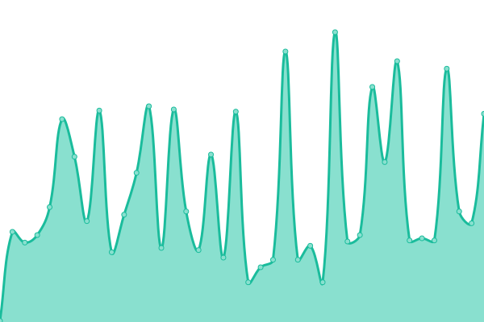

# [📈 Live Status](https://fsdh-pfds.github.io/status-statut): <!--live status--> **🟩 All systems operational**

This repository contains the open-source uptime monitor and status page for [Federal Science DataHub (FSDH) - Plateforme fédérale de données scientifiques (PFDS)](https://sds.canada.ca/), powered by [Upptime](https://github.com/upptime/upptime).

With [Upptime](https://upptime.js.org), you can get your own unlimited and free uptime monitor and status page, powered entirely by a GitHub repository. We use [Issues](https://github.com/fsdh-pfds/status-statut/issues) as incident reports, [Actions](https://github.com/fsdh-pfds/status-statut/actions) as uptime monitors, and [Pages](https://fsdh-pfds.github.io/status-statut) for the status page.

<!--start: status pages-->
<!-- This summary is generated by Upptime (https://github.com/upptime/upptime) -->
<!-- Do not edit this manually, your changes will be overwritten -->
<!-- prettier-ignore -->
| URL | Status | History | Response Time | Uptime |
| --- | ------ | ------- | ------------- | ------ |
|  [Datahub Home](https://sds.canada.ca) | 🟩 Up | [datahub-home.yml](https://github.com/fsdh-pfds/status-statut/commits/HEAD/history/datahub-home.yml) | 

 123ms
     
 | 

<a href="https://fsdh-pfds.github.io/status-statut/history/datahub-home">100.00%</a>
    

|  [Production FSDH Portal](https://federal-science-datahub.canada.ca/login) | 🟩 Up | [production-fsdh-portal.yml](https://github.com/fsdh-pfds/status-statut/commits/HEAD/history/production-fsdh-portal.yml) | 

 330ms
     
 | 

<a href="https://fsdh-pfds.github.io/status-statut/history/production-fsdh-portal">100.00%</a>
    

<!--end: status pages-->

[**Visit our status website →**](https://fsdh-pfds.github.io/status-statut)

## 📄 License

- Powered by: [Upptime](https://github.com/upptime/upptime)
- Code: [MIT](./LICENSE) © [Anand Chowdhary](https://anandchowdhary.com), supported by [Pabio](https://pabio.com)
- Data in the `./history` directory: [Open Database License](https://opendatacommons.org/licenses/odbl/1-0/)
